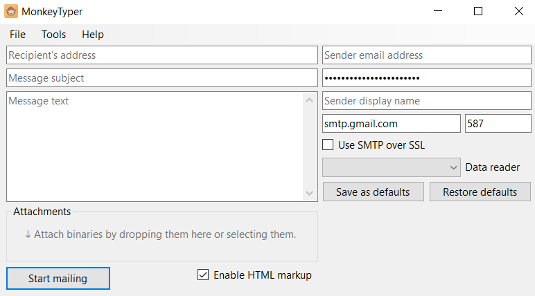

# MonkeyTyper

 [![NuGet: MonkeyTyper.Core][1]][2]
 [![License][3]][4]


MonkeyTyper is an extensible application that was created for sending bulk emails.

## 📦 Available Packages

| Description  | Package |
| ------------- | ------------- |
| Core library  | [![NuGet: MonkeyTyper.Core][1]][2] |
| Plugin that allows application to read data from DSV files  | [![NuGet: MonkeyTyper.Plugins.DataReaders.DSV][5]][6] |

## 💻 Applications

### MonkeyTyper.WinForms

MonkeyTyper's implementation based on Windows Forms (a.k.a. WinForms):



**Requirements**:

- Windows 7+ or Windows Server 2008 R2 SP1+
- [.NET Framework 4.6.1+](https://dotnet.microsoft.com/download/dotnet-framework/) or [.NET Core 3.1+ Desktop Runtime](https://dotnet.microsoft.com/download/dotnet-core/3.1)

**Abilities** (✔️ - Done, ⚠️ - W.I.P., ❌ - Not supported):

✔️ Send bulk emails<br>
✔️ Pause mailing process<br>
✔️ Cancel mailing process<br>
✔️ Replace email's dynamic fields with external data<br>
✔️ Add and modify email's attachments<br>
✔️ Manual plugin installation<br>
⚠️ Online plugin installation<br>
⚠️ Automatic plugin removal<br>
⚠️ Internationalization<br>
⚠️ Automatic update<br>
❌ Cross-platform<br>

**Download**:

 - .NET Framework 4.6.1+ [latest release](https://github.com/Kir-Antipov/MonkeyTyper/releases/latest/download/MonkeyTyper.WinForms-net461.zip)
 - .NET Framewrok 4.8+ [latest release](https://github.com/Kir-Antipov/MonkeyTyper/releases/latest/download/MonkeyTyper.WinForms-net48.zip)
 - .NET Core 3.1+ [latest release](https://github.com/Kir-Antipov/MonkeyTyper/releases/latest/download/MonkeyTyper.WinForms-netcoreapp3.1.zip)

## 📤 Usage

It's very easy to start sending out emails!

1. Start `MonkeyTyper`.
1. Fill in the following fields:
    - Your email address
    - Your email password
    - Your email display name ✏️
    - SMTP host
    - SMTP port
    - Recipient's address ✏️
    - Message subject ✏️
    - Message text ✏️
1. Add attachments to the message, if necessary.
1. Select an available data reader (e.g., `SinglelineDSVReader` from [![NuGet: MonkeyTyper.Plugins.DataReaders.DSV][5]][6]).
1. Click on the confirm button.
1. Enjoy the process 🙂

All fields marked with the "✏️" symbol can contain dynamic data that will be provided by the selected data reader for each data entry (e.g., for each row of the CSV file).

The text containing dynamic data looks like this: `Hello, {name}! What {value} is it now?`. If we'll take CSV as a data source with the following content:
```csv
name,value
World,day
Gregory,time
Helen,day of the week
```

We'll get the following output:
```csv
Hello, World! What day is it now?
Hello, Gregory! What time is it now?
Hello, Helen! What day of the week is it now?
```

So you can dynamically substitute absolutely anything, from the email recipient's address to specific parts of your message.

⚠️ **Attention!** Since you may need curly braces (`{`) in your message, remember to escape them with a backslash (`\`). Also, don't forget to escape the backslash if you need it:

 - `{name}` -> `World`
 - `\{name}` -> `{name}`
 - `\\{name}` -> `\World`
 - `\\\{name}` -> `\{name}`

## 💾 Plugin Development

Each `MonkeyTyper` implementation relies on *dependency injection* and a *high level of abstraction*, making it extremely easy to develop plugins for it (as well as plugins for its plugins 🙂). All you need to do is create a portable class library (`.dll`), define a public class there, and specify how to register it.

You can also upload your plugin to [NuGet](https://nuget.org/) so that it can be found using the in-app plugin installer (remember to tag your package with the `monkey-typer-plugin`), but this is not necessary: you can simply add the compiled assembly to your application's `plugins` folder.

### Project Tips

The core library supports the following list of frameworks:

 - net461
 - net48
 - netstandard2.0
 - netstandard2.1

So it would be good if your plugin supports all the mentioned frameworks. This guarantees full compatibility with any of the `MonkeyTyper` implementations:
```xml
<TargetFrameworks>net461;net48;netstandard2.0;netstandard2.1</TargetFrameworks>
```

If you want your plugin to be able to be installed online, upload it to [NuGet](https://nuget.org/) and don't forget to tag it with the `monkey-typer-plugin`:
```xml
<GeneratePackageOnBuild>true</GeneratePackageOnBuild>
<PackageTags>monkey-typer-plugin</PackageTags>
```

### Service Definition

It's really easy to define a service: you just need to create a `public` class and mark it with the `ServiceAttribute`. Then your service will be injected into the project, unless another plugin overwrites it.

`ServiceAttribute` has the following properties:

  - `Lifetime` - The lifetime of your service. Default value is `ServiceLifetime.Scoped`.
  - `ServiceType` - The service type that your class implements. If no value was provided, the type to which the attribute was applied is used.
  - `SettingsType` - You can register a service-related settings type that implements the `ISettings` interface. Default value is `null`.

Let's take a look at this example:

```csharp
using MonkeyTyper.Core.Data;
using MonkeyTyper.Core.Plugins;

namespace Foo
{
    // Lifetime = ServiceLifetime.Scoped:
    // Our service will be re-created for each new scope.
    //
    // ServiceType = typeof(IDataReader):
    // Our class implements the IDataReader service.
    //
    // SettingsType = typeof(FooSettings):
    // User can change the settings of our service using FooSettings.
    [Service(Lifetime = ServiceLifetime.Scoped, ServiceType = typeof(IDataReader), SettingsType = typeof(FooSettings))]
    public class FooReader : DataReader
    {
        // FooSettings:
        // User-supplied settings for this class. Always up-to-date. Required.
        //
        // IStringFormatter:
        // Service provided by dependency injection. Required.
        //
        // IBar:
        // Service provided by dependency injection. Optional.
        // If no service was registered it will be null.
        public FooReader(FooSettings settings, IStringFormatter formatter, IBar? bar = null)
        {
            // .ctor implementation
        }

        // Service implementation
    }
```

### Service Settings Definition

As you could see, user can customize your service's behaviour using the settings specified in the `SettingsType` property of the `ServiceAttribute`.

The settings object must meet the following requirements:
- It must implement the `ISettings` interface.
- Guid of its type must be constant (mark your class with the `System.Runtime.InteropServices.GuidAttribute`).
- It should contain only primitive objects (numbers, booleans, dates, strings), their nullable variations and objects that implement `ISettings`. **Complex objects that don't implement `ISettings` aren't supported**!

Your settings type and its properties can use the `DisplayName` and `Description` attributes from the `System.ComponentModel`.

The easiest way to implement `ISettings` is to inherit your settings type from `Settings`:

```csharp
using MonkeyTyper.Core.Plugins;
using System;
using System.ComponentModel;
using System.Runtime.InteropServices;

namespace Foo
{
    [Guid("4DD21A83-1234-46D1-5678-B230CF4AECCC")]
    [DisplayName("Settings for FooReader")]
    public sealed class FooSettings : Settings
    {
        [DisplayName("Bar property")]
        public string Bar { get; set; } = string.Empty;

        [DisplayName("Baz property")]
        public int Baz { get; set; } = 42;
    }
}
```

### Built-in Services

Here we'll describe the standard services that can be overridden/supplemented with plugins:

| Service interface | Description | Default implementation | Recommended base class | Tips |
| ----------------- | ----------- | ---------------------- | ---------------------- | ---- |
| `IMailClient` | A mail client that can be used to send email messages. | `DefaultMailClient` | - |
| `IMessageBuilder` | This interface provides the ability to create a `MimeMessage` message. | `DefaultMessageBuilder` | - |
| `IMessageMutator` | Describes a transformation of a message object. | - | - | Since all mutators registered in the app are applied to message, it's recommended to add settings to your plugin to allow user to turn your mutator on and off.
| `IStringFormatter` | Defines a method that supports custom string formatting. | `DefaultStringFormatter` | `StringFormatter` |
| `IDataReader` | Provides a means of reading one or more forward-only streams of result sets obtained from a data source. | - | `DataReader` | Don't confuse this class with the `System.Data.IDataReader`. |
| `ISettingsProvider` | Provides access to application/plugins settings. | `DefaultSettingsProvider` | - | Must be registered as a `ServiceLifetime.Singleton`. |
| `IPluginManager` | Describes methods for interacting with custom plugins. | `DefaultPluginManager` | - |

## 📚 Documentation

Check out the full [documentation](https://kir-antipov.github.io/MonkeyTyper/Help) for more details.

## 🙋‍♀️🙋‍♂ Contributions

1. [Fork](https://github.com/Kir-Antipov/MonkeyTyper/fork) or [download](https://github.com/Kir-Antipov/MonkeyTyper/archive/development.zip) this repository.
1. Create a feature branch from the `development` branch.
1. Implement your wonderful ideas.
1. Create a pull request.

## 📑 License

MIT © [Kir_Antipov](https://github.com/Kir-Antipov/)

[1]: https://img.shields.io/nuget/v/MonkeyTyper.Core.svg?style=flat-square&label=MonkeyTyper.Core&cacheSeconds=3600
[2]: https://www.nuget.org/packages/MonkeyTyper.Core/

[3]: https://img.shields.io/github/license/Kir-Antipov/MonkeyTyper.svg?style=flat-square&label=License&cacheSeconds=36000
[4]: https://raw.githubusercontent.com/Kir-Antipov/MonkeyTyper/master/LICENSE.md

[5]: https://img.shields.io/nuget/v/MonkeyTyper.Plugins.DataReaders.DSV.svg?style=flat-square&label=MonkeyTyper.Plugins.DataReaders.DSV&cacheSeconds=3600
[6]: https://www.nuget.org/packages/MonkeyTyper.Plugins.DataReaders.DSV/